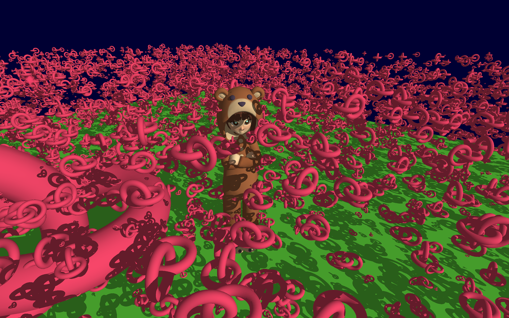

# Ray Tracing Gallery

A work-in-progress

## Features

* Uses bindless textures and buffers to render multiple models via ray tracing
* Top-Level Acceleration Structure updates to dynamically alter the scene.
* Basic lighting and shadows
* Double-buffering
* A controllable camera and directional light source

## Todo

* Soft shadows ([Ray Tracing Gems II], Chapter 24) and a shadow denoiser pass
* Fixes for the shadow terminator ([Ray Tracing Gems II], Chapter 4)
* Ray traced ambient occlusion

## Acknowledgements and sources

* The [NVIDIA Vulkan Ray Tracing Tutorial](https://nvpro-samples.github.io/vk_raytracing_tutorial_KHR/)
* [Sascha Willems'](https://github.com/SaschaWillems) [Vulkan examples](https://github.com/SaschaWillems/Vulkan/)
* [evopen](https://github.com/evopen)/[silly-cat-engine](https://github.com/evopen/silly-cat-engine) for some help with understanding the `vk::AccelerationStructureInstanceKHR` struct and various other rust-specific details.
* [Lain model by woopoodle on Sketchfab](https://sketchfab.com/3d-models/lain-bf255be16da34df08d48abb5443a6706)
* [Yet another blog explaining Vulkan synchronization](https://themaister.net/blog/2019/08/14/yet-another-blog-explaining-vulkan-synchronization/) - helped me a lot to fully understand pipeline barriers.
* [Vulkan Guide - Double Buffering](https://vkguide.dev/docs/chapter-4/double_buffering/)
* [Ray Tracing Gems II], Chapter 16, Page 239. for clarifying how in-place Acceleration Structures work.

[Ray Tracing Gems II]: https://link.springer.com/content/pdf/10.1007%2F978-1-4842-7185-8.pdf