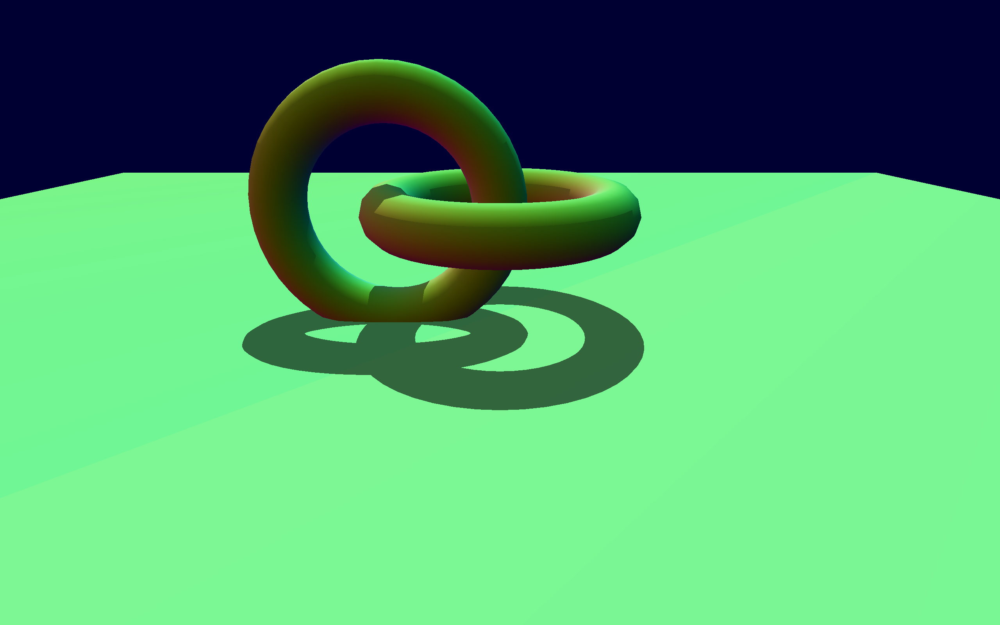

# Ray Tracing Gallery

A work-in-progress

## Acknowledgements and sources

* The [NVIDIA Vulkan Ray Tracing Tutorial](https://nvpro-samples.github.io/vk_raytracing_tutorial_KHR/)
* [Sascha Willems'](https://github.com/SaschaWillems) [Vulkan examples](https://github.com/SaschaWillems/Vulkan/)
* [evopen](https://github.com/evopen)/[silly-cat-engine](https://github.com/evopen/silly-cat-engine) for some help with understanding the `vk::AccelerationStructureInstanceKHR` struct and various other rust-specific details.